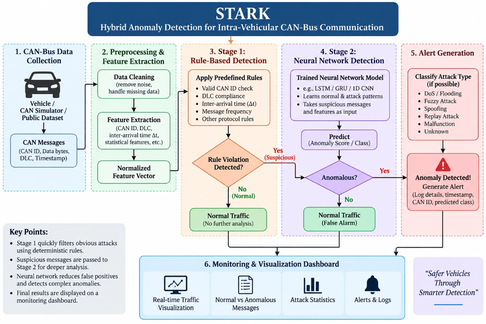

# STARK / STARF
**Hybrid Anomaly Detection for Intra-Vehicular CAN-Bus Communication**

> *"Safer Vehicles Through Smarter Detection"*



STARK is a hybrid intrusion detection system (IDS) and machine-learning workbench designed to detect cyberattacks and anomalies in intra-vehicular Controller Area Network (CAN-Bus) traffic. It features a two-stage hybrid detection pipeline (deterministic protocol rules + deep neural network classification), a FastAPI backend, and an interactive Vite/React monitoring dashboard.

For detailed design specifications, see [docs/ARCHITECTURE.md](docs/ARCHITECTURE.md).


## Quick start

```bash
cp .env.example .env
docker compose up --build
```

The frontend is available at http://localhost:5173 and the API at
http://localhost:8000. API health and metadata are available at
http://localhost:8000/api/v1/health and http://localhost:8000/docs.

### Local development

```bash
cd backend
python -m venv .venv && source .venv/bin/activate
pip install -r requirements.txt
uvicorn app.main:app --reload

cd ../frontend
npm install
npm run dev
```

Set `INTEGRATION_MODE=real` only after implementing and configuring the real service
adapters. The default `mock` mode keeps the API runnable end-to-end.

## Repository layout

```text
backend/   FastAPI application, integrations, domain modules, and tests
frontend/  Vite React TypeScript application with Tailwind CSS
data/      Local development data mount
```

## Checks

```bash
python -m compileall backend/app
cd backend && pytest
cd frontend && npm run build
```
