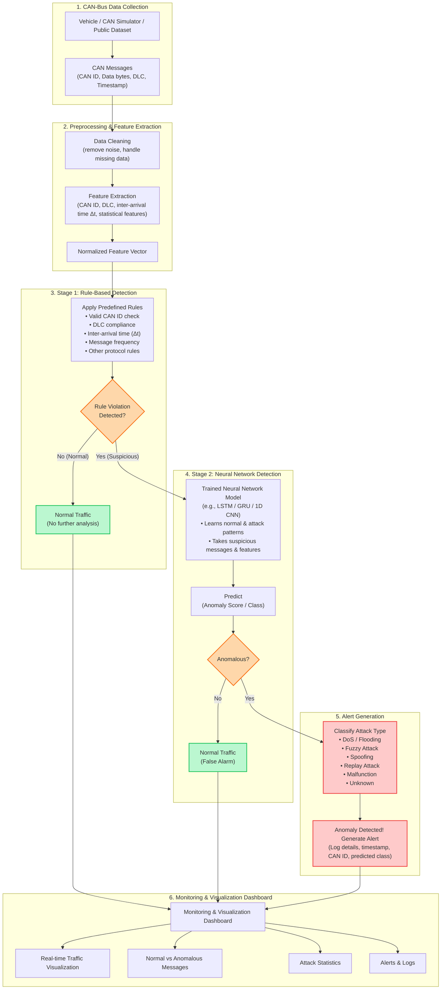

# STARK Architecture

**Hybrid Anomaly Detection for Intra-Vehicular CAN-Bus Communication**

> *"Safer Vehicles Through Smarter Detection"*

---

## Architecture Flow Diagram

---

## Key Design Principles

1. **Two-Stage Hybrid Filtering**:
   - **Stage 1 (Deterministic Rules)**: Executes in sub-milliseconds to filter known protocol anomalies and pass normal high-frequency traffic without taxing the onboard Electronic Control Unit (ECU).
   - **Stage 2 (Deep Learning)**: Evaluates only suspicious or boundary frames using temporal sequence models (LSTM, GRU, or 1D-CNN) to eliminate false positives and identify subtle, stealthy exploits.
2. **Deterministic-First Protocol Adherence**:
   - Validates CAN ID legitimacy, Data Length Code (DLC = 0–8), and expected broadcast cycle times ($\Delta t$).
3. **Comprehensive Attack Attribution**:
   - Classifies distinct attack vectors (DoS/Flooding, Fuzzy, Spoofing, Replay, and hardware malfunctions).
4. **End-to-End Observability**:
   - Feeds both normal throughput metrics and high-severity alert logs into a live visualization dashboard.

---

## Pipeline Stages

### 1. CAN-Bus Data Collection
- **Sources**: Real vehicle OBD-II / CAN interfaces, SocketCAN simulators, or benchmark datasets (e.g., Car-Hacking Dataset, OTIDS).
- **Core Attributes**: Timestamp, CAN ID (11-bit standard or 29-bit extended), DLC (payload length), and payload data bytes (`d0`–`d7`).

### 2. Preprocessing & Feature Extraction
- **Data Cleaning**: Truncate corrupted frames, handle transmission gaps.
- **Feature Extraction**:
  - Inter-arrival time difference: $\Delta t = t_i - t_{i-1}$ per CAN ID.
  - Message frequency within a sliding time window.
  - Byte entropy and bit-flip variations across sequential payloads.
- **Output**: Normalized feature vector passed to Stage 1.

### 3. Stage 1: Rule-Based Detection
Fast deterministic filtering checking against automotive safety rules:
- **CAN ID Whitelist**: Flags unauthorized arbitration IDs.
- **DLC Check**: Flags packets violating OEM payload length specs.
- **Frequency & $\Delta t$ Constraints**: Detects burst transmissions indicative of DoS or injection.
- **Branching**:
  - If compliant $\rightarrow$ classified as **Normal Traffic** (sent to telemetry metrics, no heavy ML required).
  - If non-compliant $\rightarrow$ flagged as **Suspicious** and forwarded to Stage 2.

### 4. Stage 2: Neural Network Detection
- **Model Architectures**: 1D-CNN, GRU, or Bi-LSTM trained on sequential CAN frame patterns.
- **Function**: Distinguishes true multi-frame attack patterns from momentary benign jitter or sensor noise (false alarms).
- **Branching**:
  - Anomaly score below threshold $\rightarrow$ marked as **Normal Traffic (False Alarm)**.
  - Anomaly score above threshold $\rightarrow$ confirmed attack, forwarded to Alert Generation.

### 5. Alert Generation
- **Classification Categories**:
  - **DoS / Flooding**: High-priority ID saturation (e.g., `0x000`).
  - **Fuzzy Attack**: Random IDs and random payloads injected simultaneously.
  - **Spoofing**: Impersonation of critical safety nodes (e.g., steering, braking).
  - **Replay Attack**: Re-injection of valid historical traffic sequences.
  - **Malfunction**: Hardware or bus-off errors.
  - **Unknown**: Novel anomaly signatures.
- **Action**: Constructs structured alert payload containing timestamp, affected CAN ID, attack severity, and confidence score.

### 6. Monitoring & Visualization Dashboard
- **Live Throughput**: Real-time CAN bus traffic line graphs.
- **Traffic Composition**: Normal vs. Anomalous message ratio.
- **Attack Breakdown**: Category charts (DoS, Fuzzy, Spoofing, etc.).
- **Incident Feed**: Real-time tabular event logs with severity filters.

---

## Codebase Mapping

| Architecture Stage | Repository Path |
|---|---|
| 1. CAN-Bus Ingestion | [`backend/app/modules/dataset`](file:///Users/sannidhichouthayi/starf/backend/app/modules/dataset), [`data/`](file:///Users/sannidhichouthayi/starf/data) |
| 2. Preprocessing & Features | [`backend/app/modules/dataset`](file:///Users/sannidhichouthayi/starf/backend/app/modules/dataset) |
| 3. Rule-Based Detection | [`backend/app/modules/detection`](file:///Users/sannidhichouthayi/starf/backend/app/modules/detection) (`DetectionService`) |
| 4. Neural Network Detection | [`backend/app/modules/ml`](file:///Users/sannidhichouthayi/starf/backend/app/modules/ml) (`MlService`) |
| 5. Alert Generation | [`backend/app/modules/alerts`](file:///Users/sannidhichouthayi/starf/backend/app/modules/alerts) (`AlertsService`) |
| 6. Telemetry & Dashboard | [`frontend/src`](file:///Users/sannidhichouthayi/starf/frontend/src) |
