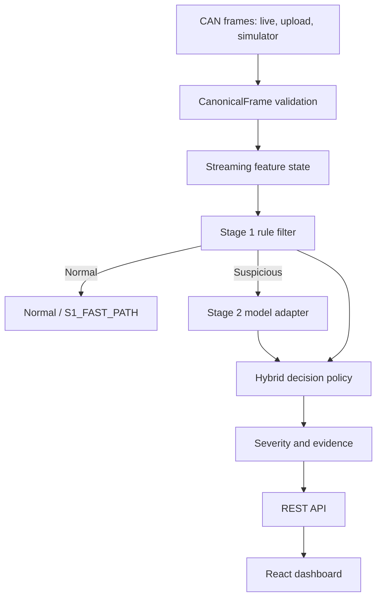

# STARK architecture

This document is the repository-level architecture reference for the current
implementation of **STARK — Smart Traffic Anomaly Recognition Kernel**.

## System flow



## Implemented now

| Architecture component | Repository implementation |
| --- | --- |
| Canonical frame contract | `backend/app/modules/detection/pipeline.py: CanonicalFrame` |
| Shared pipeline entry point | `DetectionPipeline.process()` |
| Streaming feature engineering | `StreamState` and `_process_frame()` |
| ID repetition and burst features | `id_repetition_count`, `id_consecutive_run`, `msg_rate`, `unique_ids_window` |
| Payload features | `bytes_changed_prev`, `payload_entropy`, payload history |
| Stage 1 rule filter | Rules R1, R3, R4, R6, R7, and R8 in `_process_frame()` |
| Hybrid decision paths | `S1_FAST_PATH`, `S1_S2_CONFIRMED`, `HARD_VIOLATION`, `LOW_CONFIDENCE` |
| Severity output | `severity_score` and `severity` |
| Label firewall | `FrameBatch` accepts inference fields only; labels do not enter the pipeline |
| Backend API | `POST /api/v1/detection/frames` |
| Dashboard integration | `frontend/src/shared/api/client.ts` and `frontend/src/App.tsx` |

## Request and response flow

The detection endpoint accepts a batch of canonical frames:

```json
{
  "frames": [
    {
      "frame_index": 0,
      "timestamp": 0.0,
      "can_id": 256,
      "dlc": 3,
      "data": [1, 2, 3],
      "source_dataset": "live",
      "capture_id": "stream"
    }
  ]
}
```

Each result includes:

- Stage 1 flag, violated rules, score, and hard-violation status.
- Stage 2 class, confidence, and probabilities when Stage 1 is suspicious.
- Final class, confidence, decision path, alert-candidate status, and severity.
- Feature evidence used for the decision.

Normal traffic takes the fast path and does not invoke Stage 2:
`decision_path = "S1_FAST_PATH"`.

## Planned architecture phases

The repository is not yet a complete production implementation of every section
in `STARK_PROJECT_ARCHITECTURE.pdf`. These components remain planned:

1. Car-Hacking and OTIDS ingestion adapters with data-quality reports.
2. Persistent sessions, detection results, alerts, and explanation repositories.
3. Config files for calibrated Stage 1 rules, decision thresholds, and severity weights.
4. A verified MLP/Random Forest model artifact and model metadata.
5. SHAP explanations generated asynchronously for alerts.
6. Alert aggregation, simulator controls, training CLI, and evaluation metrics.
7. Dashboard charts, alert details, and real-time polling.

The current Stage 2 value is explicitly a deterministic `rule-fallback`; it is
not a trained model and must not be presented as trained-model performance.

## Relevant entry points

```text
backend/app/api/routes/detection.py       HTTP detection endpoint
backend/app/modules/detection/pipeline.py Shared detection pipeline
backend/app/api/routes/health.py           Runtime architecture/model status
frontend/src/App.tsx                       Dashboard status and KPI cards
backend/tests/test_health.py               Pipeline smoke tests
```
